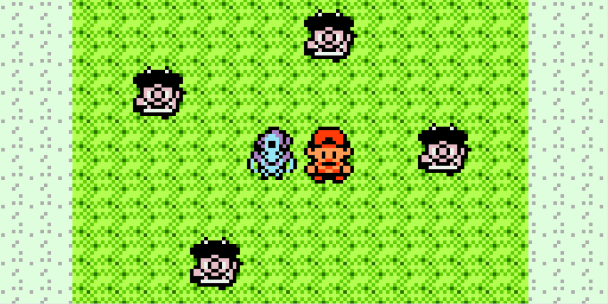

# Untamed Tohjo

*Seamless overworld encounters for every wild Pokémon. Spot them on the map, track down roamers in real-time, and just walk up to start a battle.*

## Features

### Core Mechanics
- **True Overworld Encounters:** Ditch the random grass encounters. Every wild Pokémon spawns directly on the map, including time-of-day specific spawns, surfing and fishing encounters (fishing mons are based on the rods you own), and wandering legendary roamers. 
- **Expanded Dex Compatibility:** Built with full overworld sprite and mechanic support for every Pokémon up to Arceus. While the mod itself doesn't inject new species into the base game, it works flawlessly out-of-the-box with mods like *Kanto Reforged* meaning Hoenn species and beyond will seamlessly wander the overworld.
- **Encounter Chaining:** Build a streak by continually battling or catching the same species. High chains guarantee better DVs and significantly boost shiny odds (up to ~1/100 at a 100 streak).
- **Incense Menu:** Tailor the overworld to your playstyle via a new "Incense" option integrated directly into the Start Menu. Adjust spawn density (Low, Medium, High, Off) or use "Repel" mode to wipe standard encounters and exclusively hunt roamers.

### Immersive World
- **Real-Time Shinies & Forms:** No battle-screen surprises. Shiny Pokémon display their exact palettes and sparkle directly on the overworld, complete with a custom shiny glyph in the battle HUD. Form differences like Unown letters also render correctly in the overworld.
- **Living World Reskins:** Generic NPC sprites are gone. Town pets, event Pokemon (like Lance's Dragonite), and Pokémon left at the Daycare dynamically render as their exact species.

### HGSS-Style Followers
- **Dynamic Companions:** Choose exactly who follows you. Press Select on the party screen to designate any party member (marked with a heart) as your follower, or turn the feature off entirely. Your companion seamlessly transitions to a swimming animation on water and retreats into its Pokéball during Pokémon Center heals.
- **Context-Aware Reactions:** Interact with your follower to see custom emoticons based on their current HP, status ailments (like shivering when poisoned), and surrounding environment (e.g., Fire-types reacting poorly to rain).
- **Foraging:** Walk long enough, and your follower will dig up items. Higher friendship yields rarer, location-specific loot like evolutionary stones; but unloved Pokémon might refuse to share their finds!

## Credits

- **MegamanOmega & FrenchOrange** - Overworld sprites
- **ShockSlayer & the Crystal Clear team** - More overworld sprites and the Pokéball drop sprite
- **Asef Ben-Non** - GHOST sprite
- **FrenchOrange** - Emoticons

## Inspirations
- **ShockSlayer & the Crystal Clear team** - The amazing follower system was my baseline inspiration
- **Wilds of Kanto team** - Inspiration for the wild encounter system
- **Pokeabbie (Emerald Rogue)** - Inspiration for the encounter chaining system
- **GameFreak and The Pokemon Company** - Duh.
